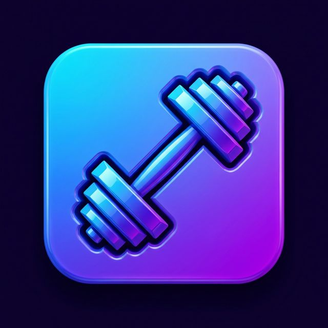

# Gains 🏋️‍♂️

**Gains** is your ultimate companion for strength training and progress tracking. Log workouts, track personal records, analyze your progress, and manage your physique with an intuitive and powerful interface.



## ✨ Features

- **📊 Comprehensive Analytics**:
  - Visualize your progress with interactive charts and heatmaps.
  - Track **Weight**, **Body Fat**, and other body measurements over time.
  - Automatically calculate and update your **1RM** (One-Rep max) for every lift.

- **💪 Workout Tracking**:
  - Create custom **Workout Templates** with specific sets and reps.
  - Seamlessly log active workouts with real-time feedback.
  - View exercise history and previous bests during your session.

- **🏆 Personal Records**:
  - Keep track of your all-time best lifts.
  - Celebrate new PRs with instant notifications.

- **🔔 Smart Reminders**:
  - Set daily workout reminders to stay consistent.
  - Customizable notification schedules.

- **🔒 Secure & Sync**:
  - Full cloud synchronization powered by **Firebase**.
  - Secure authentication via email/password.

## 📱 Screenshots

| Home Screen | Workout Builder | Active Workout | Analytics |
|:-----------:|:---------------:|:--------------:|:---------:|
|  |  |  |  |


## 🛠️ Technology Stack

This project is built with a modern Flutter stack, ensuring performance and maintainability.

- **Framework**: [Flutter](https://flutter.dev/) (SDK 3.10+)
- **State Management**: [Riverpod](https://riverpod.dev/) (`flutter_riverpod`)
- **Backend & Auth**: [Firebase](https://firebase.google.com/) (Auth, Firestore)
- **Charts**: [fl_chart](https://pub.dev/packages/fl_chart)
- **Local Storage**: [shared_preferences](https://pub.dev/packages/shared_preferences)
- **Utilities**: `intl`, `permission_handler`, `flutter_local_notifications`

## 🚀 Getting Started

Follow these steps to set up the project locally.

### Prerequisites

- [Flutter SDK](https://docs.flutter.dev/get-started/install) installed.
- A [Firebase Project](https://console.firebase.google.com/) created.

### Installation

1.  **Clone the Repository**
    ```bash
    git clone https://github.com/yourusername/gains.git
    cd gains
    ```

2.  **Install Dependencies**
    ```bash
    flutter pub get
    ```

3.  **Firebase Configuration**
    - Create a Firebase project.
    - Add an Android app and download `google-services.json` to `android/app/`.
    - Add an iOS app and download `GoogleService-Info.plist` to `ios/Runner/`.
    - Enable **Authentication** (Email/Password).
    - Create a **Firestore Database**.

4.  **Run the App**
    ```bash
    flutter run
    ```

## 📂 Project Structure

```
lib/
├── models/         # Data models (User, Workout, Tracker)
├── providers/      # Riverpod providers for state management
├── screens/        # UI Screens (Auth, Home, Workout, Analytics)
├── services/       # Backend services (Auth, Database, Notification)
├── utils/          # Helper functions and constants
└── main.dart       # App entry point
```

## 📄 License

This project is licensed under the MIT License - see the [LICENSE](LICENSE) file for details.
